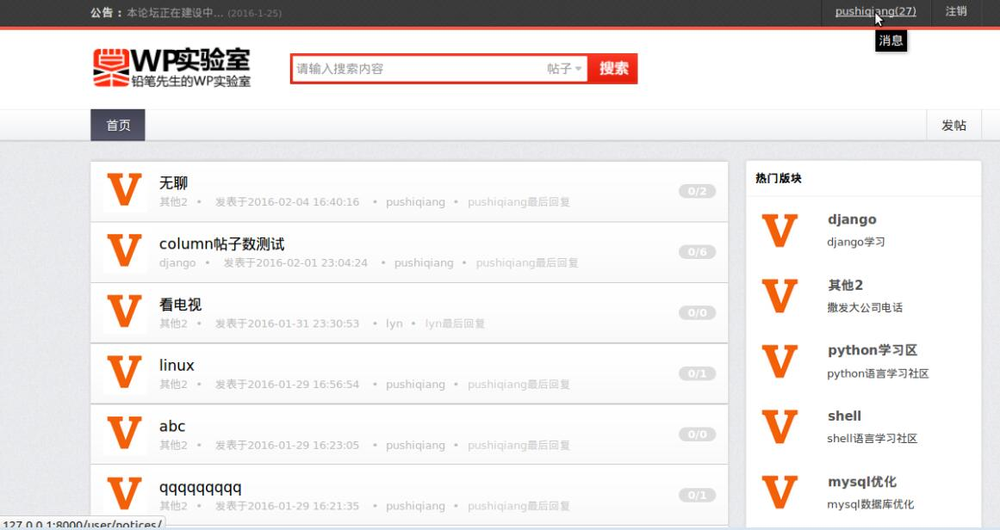
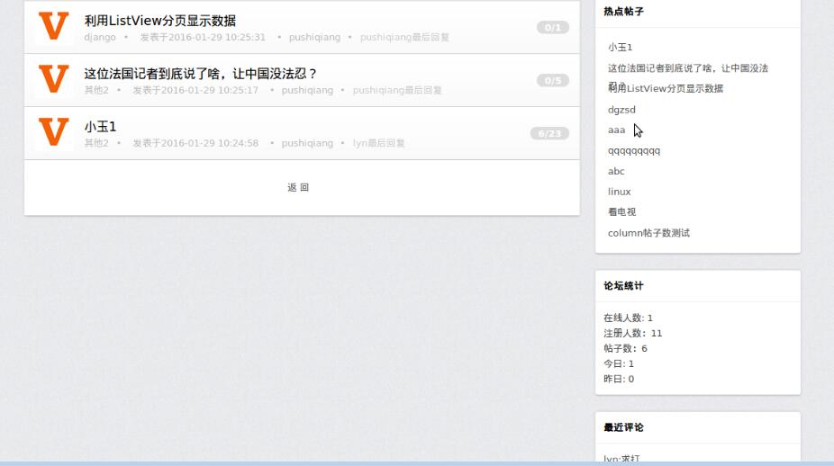
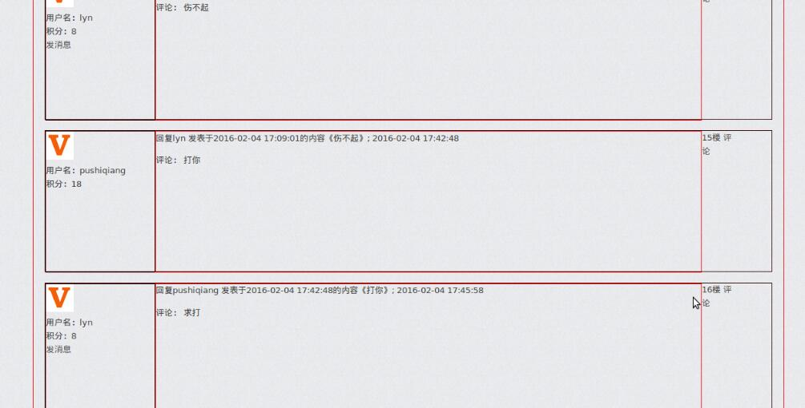
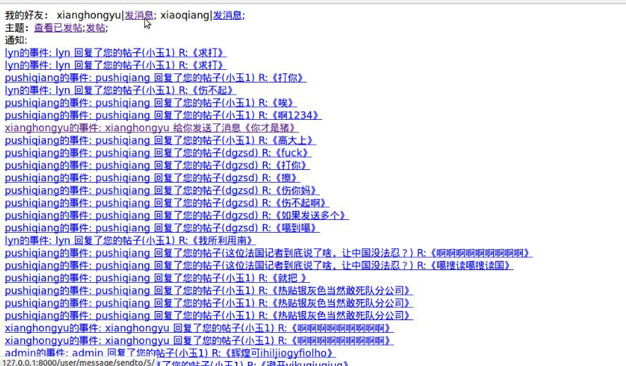
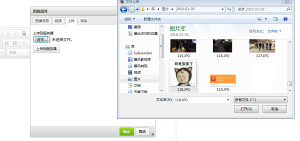
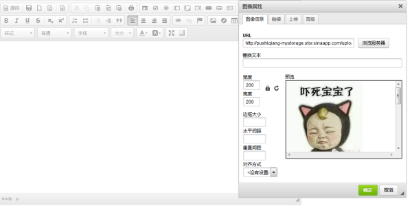
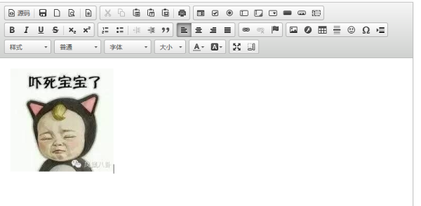

# django_forum
# 个人博客：pushiqiangblog.applinzi.com
This is a small and simple forum which uses the Django Framework (written in Python language). 
这是一个基于django的小型论坛系统

新手入门之作，初学者代码质量很差，严重不满足pep8规范，木有时间重构，大家看看就行

这是个基于 Python django 的小型论坛系统
---
本系统实现了一般论坛的主要功能，包括发帖，评论，评论回复，评论通知，加好友，好友消息,消息通知，简单积分规则。

由于作者的前台技术不咋的，所以前台页面随便找了两个模版套上，大部分页面都只有模版标签，大家就看个功能吧，熟悉前台的可以自己写个漂亮的页面，把标签套上就可以了。
 

python 2.7 + django 1.7 
系统部署于新浪云SAE (django1.5)(关于SAE部署静态文件问题，SAE默认是static，这时可以设置STATIC_ROOT=os.path.join(BASE_DIR, "static")，在本地执行了collectstatic后，将static文件夹部署) 
demo演示:[http://pushiqiang.sinaapp.com/](http://pushiqiang.sinaapp.com/) 
github地址:[https://github.com/pushiqiang/django_forum.git](https://github.com/pushiqiang/django_forum.git) 
qq:983003089

更新：
---
2016.2.12  更新发帖验证码功能 
2016.2.23  添加删帖权限验证装饰器（@delete_permission 仿 @login_required），简单权限管理，普通用户不允许删帖，只有用户的privilege字段为1才允许删帖。 
2016.4.11  添加ckeditor编辑器图片上传插入功能，因为sae代码空间没有IO权限，故将图片上传到sae的storage

功能：
---
1.发帖，删帖，编辑功能，使用ckeditor富文本编辑器,实现本地图片上传插入。 
2.多级评论，评论单级列表显示。 
3.加好友功能，好友消息功能，贴子评论回复通知功能。 
4.实现了用户注册,登陆功能（头像，密码更改，密码找回功能还未实现），通过邮箱通知注册用户。 
5.论坛在线人数统计，帖子评论/浏览数统计。 
6.简单的积分规则，发帖+5，登录+1，评论+3 
 

使用到的技术：
---
1.中间件技术（实现在线人数统计）。 
2.自定义过滤器（好友判断)。 
3.装饰器（删帖权限验证装饰器@delete_permission 仿 @login_required）。 
4.通用类视图（ListView，DetailView，CreateView，UpdateView，DeleteView）。 
5.django信号机制+ContentType机制(实现帖子消息评论回复功能）。 
6.少量缓存功能。 

 
PS：在网上找了很久基于django的论坛系统，有很多blog系统，却很少发现forum系统，有个lbforum系统还是个论坛引擎框架，故一直想自己写个小微型的django论坛系统，于是趁着过年几天的空闲写了这么个系统，权当练手了，可能还有很多bug和待改善的地方，大神勿笑，有兴趣的朋友可以看看。 

预览
---

